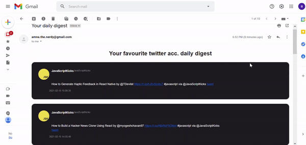

# twitter daily digest



built with python and gmail-api

## how to use

### installation

```bash
pip install requirements
```

in tw.py 
you can select the accounts you want to be in your daily digest and home many tweets

```
   # Add the user Id you want to get tweets
    user_id = "JavaScriptKicks"


    # Add the number of tweets you want to get
    number_of_tweets = 10
```
 


## Usage

you can add it to your task manager to run daily or use time and schedule packages and have it in Heroku

```python 
python sendMil.py
```
